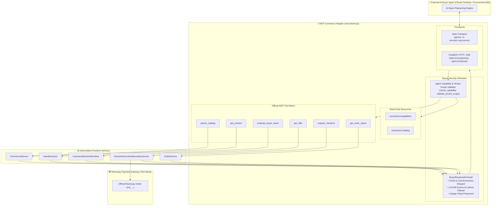
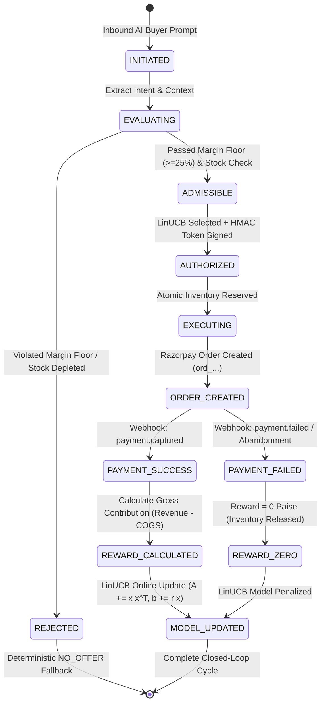

# 🏛️ System Architecture Specification

> **Merchant Policy Agent**: Autonomous Commercial Policy Learning for the Agentic Commerce Era  
> **Target Framework**: Razorpay AI Buildathon 2026 — Track 01: Agentic Commerce  
> **Release Candidate**: `v1.0.0-rc` | **Authoritative Parent Tests**: 942 Passed (100%) | **Adversarial Benchmarks**: 49/49 Passed (100%)

---

## 🧭 Executive Architectural Summary

The **Merchant Policy Agent** provides autonomous commercial negotiation for merchants selling to AI purchasing agents. To prevent financial ruin (such as margin-destroying hallucinated discounts or overselling inventory) while staying competitive against fast-moving AI buyers, the system enforces a strict foundational invariant:

```text
┌─────────────────────────────────────────────────────────────────────────────────────────────┐
│                                   THE CORE INVARIANT                                        │
│                                                                                             │
│       LLM Proposes ➔ Code Validates ➔ Code Executes ➔ Razorpay Reports ➔ Agent Learns        │
└─────────────────────────────────────────────────────────────────────────────────────────────┘
```

The system is architected across **Three Decoupled Planes**:
1. **Execution Plane (Deterministic, Real-Time $<70$ms)**: Fast-path transaction processing where advisory LLM candidate strategies are audited by hardcoded margin and stock rules before creating an authentic Razorpay Test Order.
2. **Learning Plane (Authoritative Financial Feedback)**: Asynchronous, event-driven learning loop triggered exclusively by cryptographically signed Razorpay payment webhooks, updating an online **LinUCB contextual multi-armed bandit**.
3. **Governance Plane (Merchant Supervisory Control)**: Operator dashboard, candidate policy quarantine sandbox, and statistical promotion gates requiring sample proof ($N \ge 100$) and positive contribution margins.

---

## 🗺️ High-Level System Architecture Diagram

```mermaid
flowchart TB
    subgraph AI_BUYER["🤖 EXTERNAL AI BUYER AGENT"]
        direction TB
        BuyerReq["Inbound Buyer Request / Natural Language Prompt<br/><i>'Travel backpack under ₹8,000 for 16-inch laptop'</i>"]
        BuyerCheckout["Test Mode Checkout Interaction<br/>(UPI / Card Simulation)"]
    end

    subgraph EXECUTION_PLANE["⚡ 1. EXECUTION PLANE (Deterministic, Real-Time &lt; 70ms)"]
        direction TB
        subgraph Intent_Module["Intent & Context Subsystem"]
            Normalizer["Stage 1: IntentNormalizer<br/>• Prompt Injection Scrubbing<br/>• Unicode Sanitization<br/>(4.2ms)"]
            Extractor["Stage 2: IntentExtractor<br/>• Budget Normalization (Paise)<br/>• Hard Specs vs Soft Desires<br/>(18.5ms)"]
            Commerce["Stage 3: CommerceService<br/>• Catalog Lookup & Wholesale COGS<br/>• Real-time Inventory Audit<br/>(6.1ms)"]
        end

        subgraph Policy_Module["Policy Strategy & Advisory LLM"]
            AgentNode["Stage 4: MerchantPolicyAgent (LLM Advisory)<br/>• SINGLE_PRODUCT<br/>• COMPLEMENTARY_BUNDLE<br/>• ALTERNATIVE_PRODUCT<br/>• BOUNDED_DISCOUNT<br/>• Reserve Baseline NO_OFFER<br/>(12.3ms)"]
        end

        subgraph Validation_Module["Deterministic Safety & Selection"]
            Safety["Stage 5: PolicySafetyValidator<br/>• Gross Margin Floor &ge; 25.00%<br/>• Discount Ceiling &le; 20.00%<br/>• Real-time Stock &gt; 0<br/>• Integer Paise Arithmetic<br/>(3.4ms)"]
            Selector["Stage 6: PolicyCandidateSelector<br/>• 19-Dimensional Feature Vector x<br/>• LinUCB Covariance Query<br/>• Bounded Exploration Check (&le; 15%)<br/>(5.8ms)"]
        end

        subgraph Boundary_Module["Execution Boundary & Authorization"]
            FreshSafety["Stage 7: Fresh Safety & Inventory Lock<br/>• SELECT ... FOR UPDATE<br/>• Atomic Stock Reservation<br/>(8.2ms)"]
            Authorizer["Stage 8: ExecutionAuthorizer<br/>• HMAC-SHA256 Token Signing<br/>• Idempotency Correlation<br/>(1.2ms)"]
            OrderCreator["Stage 9: RazorpayOrderCreator<br/>• POST /v1/orders<br/>• Integer Paise Order Creation<br/>(22.4ms)"]
        end
    end

    subgraph RAZORPAY_GATEWAY["💳 RAZORPAY PAYMENT GATEWAY (Test Mode)"]
        direction TB
        RzpOrder["Official Razorpay Order<br/>(ID: ord_...)"]
        RzpPayment["Payment Capture Processing<br/>(ID: pay_...)"]
        RzpWebhook["Cryptographic Webhook Dispatch<br/>(payment.captured / payment.failed)"]
    end

    subgraph LEARNING_PLANE["🧠 2. LEARNING PLANE (Authoritative Financial Feedback)"]
        direction TB
        WebhookHandler["Stage 10: RazorpayWebhookHandler<br/>• HMAC-SHA256 Signature Verification<br/>• Event Deduplication (Idempotency)<br/>(4.1ms)"]
        OutcomeService["Stage 11: OutcomeFeedbackService<br/>• Payment State Reconciliation<br/>• Stock Commit (Paid) or Release (Failed)<br/>(7.5ms)"]
        RewardEngine["Gross Economic Reward Engine<br/>• If PAID: r = Revenue - COGS (Paise)<br/>• If FAILED: r = 0 Paise (Truthful Penalty)"]
        LinUCBEngine["Disjoint LinUCB Bandit Update<br/>• Feature Covariance: A &larr; A + x x^T<br/>• Reward Bias Vector: b &larr; b + r x<br/>• Weight Vector: &theta; = A^(-1) b<br/>• Anti-Temporal Leakage Check (t_event &lt; t_decision)"]
        PolicyMemory["Policy Memory & Evidence Ledger<br/>• LearningEvidenceRecord<br/>• PolicyMemoryRecord"]
    end

    subgraph GOVERNANCE_PLANE["🏛️ 3. GOVERNANCE PLANE (Merchant Supervisory Control)"]
        direction TB
        WebUI["Merchant AI Control Center (Next.js 16)<br/>• Overview Dashboard (/)<br/>• AI Decisions Ledger (/decisions)<br/>• Policy Governance (/policies)<br/>• Adaptive Learning Center (/learning)<br/>• Immutable Activity Audit (/activity)"]
        LifecycleService["PolicyLifecycleService<br/>• Candidate Registry (Quarantine)<br/>• Evidence-Gated Promotion Gate<br/>  (N &ge; 100, &Delta;Contribution &gt; 0, Safety 100%)<br/>• Active Baseline Switch & Rollback"]
    end

    subgraph PERSISTENCE["💾 PERSISTENT TRUTH LAYER (PostgreSQL 16 / SQLite)"]
        DB[(Authoritative Relational DB<br/>• merchants & catalogs<br/>• orders & payments<br/>• agent_decisions & execution_records<br/>• policy_memory_records<br/>• bandit_model_states<br/>• audit_events)]
    end

    %% Data Flows
    BuyerReq --> Normalizer
    Normalizer --> Extractor
    Extractor --> Commerce
    Commerce --> AgentNode
    AgentNode --> Safety
    Safety --> Selector
    Selector --> FreshSafety
    FreshSafety --> Authorizer
    Authorizer --> OrderCreator
    OrderCreator --> RzpOrder

    RzpOrder -.-> BuyerCheckout
    BuyerCheckout -.-> RzpPayment
    RzpPayment --> RzpWebhook

    RzpWebhook --> WebhookHandler
    WebhookHandler --> OutcomeService
    OutcomeService --> RewardEngine
    RewardEngine --> LinUCBEngine
    LinUCBEngine --> PolicyMemory

    %% Feedback to Selection
    LinUCBEngine -.->|Learned Weights &theta;| Selector
    PolicyMemory -.->|Evidence Data| LifecycleService

    %% Governance & UI Queries
    WebUI <--> LifecycleService
    WebUI -.->|Read-Only Inspection| DB
    LifecycleService <--> DB
    FreshSafety <-->|Atomic Locking| DB
    OutcomeService <-->|Commit / Release| DB
    LinUCBEngine <-->|Model Snapshot| DB
    OrderCreator <--> DB

    %% Styling
    classDef buyer fill:#2d3748,stroke:#cbd5e1,stroke-width:2px,color:#fff;
    classDef exec fill:#0f172a,stroke:#38bdf8,stroke-width:2px,color:#f8fafc;
    classDef rzp fill:#0c2340,stroke:#3395ff,stroke-width:3px,color:#fff;
    classDef learn fill:#1e1b4b,stroke:#818cf8,stroke-width:2px,color:#f8fafc;
    classDef gov fill:#064e3b,stroke:#34d399,stroke-width:2px,color:#f8fafc;
    classDef db fill:#3b0764,stroke:#c084fc,stroke-width:2px,color:#f8fafc;

    class BuyerReq,BuyerCheckout buyer;
    class Normalizer,Extractor,Commerce,AgentNode,Safety,Selector,FreshSafety,Authorizer,OrderCreator exec;
    class RzpOrder,RzpPayment,RzpWebhook rzp;
    class WebhookHandler,OutcomeService,RewardEngine,LinUCBEngine,PolicyMemory learn;
    class WebUI,LifecycleService gov;
    class DB db;
```



---

## 🔬 The Canonical 11-Stage Decision & Settlement Sequence

The end-to-end journey moves deterministically through 11 stages, connecting an untrusted natural language query to settled Razorpay currency:

```mermaid
sequenceDiagram
    autonumber
    actor Buyer as 🤖 AI Buyer Agent
    participant Normalizer as 🧼 Intent Normalizer
    participant Extractor as 📋 Intent Extractor
    participant Commerce as 📦 Commerce Service
    participant PolicyAgent as 🗣️ Policy Agent (LLM)
    participant SafetyValidator as 🛡️ Safety Validator
    participant Selector as 🧠 LinUCB Selector
    participant Boundary as 🔒 Execution Boundary
    participant Razorpay as 💳 Razorpay Test API
    participant WebhookHandler as 📬 Webhook Ingestion
    participant Learner as 📈 Learning Engine
    participant Governance as 🏛️ Policy Governance

    %% Stage 1 to 3
    Buyer->>Normalizer: Stage 1: Natural Language Query ("Backpack for trip under ₹8,000")
    Normalizer->>Extractor: Sanitized Query String (Injections Scrubbed)
    Extractor->>Commerce: Stage 2: Structured BuyerIntent (specs, budget=800000 paise)
    Commerce->>PolicyAgent: Stage 3: MerchantCommerceContext (Catalog, COGS, Inventory)

    %% Stage 4 to 6
    PolicyAgent->>SafetyValidator: Stage 4: Proposed Candidates (Standalone ₹2,999 vs Bundle ₹3,499)
    Note over SafetyValidator: Stage 5: Deterministic Commercial Pre-Validation<br/>Check Gross Margin &ge; 25.00%<br/>Check Discount &le; 20.00%<br/>Check Physical Stock &gt; 0
    SafetyValidator->>Selector: Approved Admissible Candidates
    Note over Selector: Stage 6: Contextual LinUCB Scoring<br/>Build 19-dim Context Vector x<br/>Compute UCB Score = &theta;^T x + &alpha; &radic;(x^T A^-1 x)<br/>Exploration Budget Verification (&le; 15%)
    Selector->>Boundary: Stage 7: Selected Proposal Envelope

    %% Stage 7 to 9
    Note over Boundary: Fresh Safety Re-check (Row-Level Lock)<br/>Atomically Decrement Stock Reservation
    Boundary->>Boundary: Stage 8: Compute HMAC-SHA256 Authorization Token
    Boundary->>Razorpay: Stage 9: POST /v1/orders (amount: 349900 paise, currency: INR)
    Razorpay-->>Buyer: Order Created (ord_f48bc28a3ec6)

    %% Checkout & Webhook
    Buyer->>Razorpay: Buyer completes checkout via Test UPI / Card
    Razorpay->>WebhookHandler: Stage 10: Inbound Webhook (payment.captured, pay_178c87759c5a)
    Note over WebhookHandler: Verify HMAC-SHA256 Signature<br/>Idempotency Check (Deduplicate X-Event-Id)

    %% Stage 11: Learning
    WebhookHandler->>Learner: Stage 11: Outcome Feedback & Reward Calculation
    Note over Learner: Compute Exact Gross Contribution:<br/>Revenue (₹3,499) - COGS (₹1,900) = +₹1,599 gross profit<br/>Update Ridge Regression A &larr; A + x x^T, b &larr; b + r x<br/>Commit Physical Stock to Sold Status
    Learner->>Governance: Emit Learning Evidence Record

    %% Governance
    Note over Governance: Candidate Policy Evidence Accumulation<br/>Evaluate Promotion Criteria (N &ge; 100, &Delta; &gt; 0)
```

---

## 🏛️ The Three Decoupled Architectural Planes

| Plane | Latency SLA | Authoritative Role | Components | Core Invariants |
| :--- | :---: | :--- | :--- | :--- |
| **1. Execution Plane** | $< 70$ms | Real-time candidate formulation, deterministic safety audit, order authorization | `IntentNormalizer`<br/>`IntentExtractor`<br/>`CommerceService`<br/>`MerchantPolicyAgent`<br/>`PolicySafetyValidator`<br/>`PolicyCandidateSelector`<br/>`DecisionExecutionBoundaryService`<br/>`RazorpayOrderCreator` | • Integer paise arithmetic only (zero float drift)<br/>• Absolute margin floor ($\ge 25\%$) cannot be bypassed<br/>• Atomic inventory locking (`SELECT ... FOR UPDATE`)<br/>• Tamper-proof HMAC execution authorization tokens |
| **2. Learning Plane** | Asynchronous ($< 15$ms) | Authoritative feedback ingestion, gross contribution calculation, online LinUCB learning | `RazorpayWebhookHandler`<br/>`OutcomeFeedbackService`<br/>`PolicyMemoryService`<br/>`PolicyLearningModelService` | • Razorpay payment capture is the ONLY positive reward signal<br/>• Abandoned/failed checkouts yield ₹0 reward<br/>• Anti-temporal leakage ($t_{\text{outcome}} < t_{\text{decision}}$)<br/>• Replay-safe event idempotency |
| **3. Governance Plane** | Human/Operator Interactive | Supervisory oversight, candidate quarantine, statistical promotion gating | `Merchant AI Control Center` (Next.js)<br/>`PolicyLifecycleService`<br/>`DashboardOverviewService`<br/>`DecisionViewService` | • Learning $\neq$ Policy Promotion<br/>• Promotion requires $N \ge 100$ verified transactions<br/>• Promotion requires positive gross contribution delta<br/>• Instant rollback to active baseline pointer |

---

## 🤖 External AI Buyer / MCP Commerce Interface (MCP 2026)

To enable external AI agents (e.g., Claude Desktop, autonomous procurement agents, personal AI shoppers) to consume the merchant's commercial policies safely, the system provides a **Thin Protocol Adapter** compliant with the Model Context Protocol (MCP 2026 specification).



### The 6 Conceptual MCP Tools & Authoritative Mapping

| MCP Tool Name | Description | Backing Service | Deterministic Invariant Preserved |
| :--- | :--- | :--- | :--- |
| `search_catalog` | Search active merchant products with category/budget filters | `CommerceService` | Real-time stock audit; excludes inactive items. |
| `get_product` | Retrieve sanitized product metadata and public pricing | `CommerceService` | Wholesale COGS / cost strictly stripped. |
| `evaluate_buyer_intent` | Structure natural language buyer prompt into constraints | `IntentExtractor` | Scrubbed of prompt injection / unicode exploits. |
| `get_offer` | Generate LinUCB-ranked commercial offer for the buyer | `CanonicalDecisionRuntime` | Margin floor ($\ge 25\%$), discount cap ($\le 20\%$), reserve `NO_OFFER`. |
| `request_checkout` | Authorize checkout and lock inventory via Razorpay | `DecisionExecutionBoundaryService` | Stock re-verified `FOR UPDATE`; Razorpay Test Mode order generated. |
| `get_order_status` | Query buyer-safe payment lifecycle and fulfillment state | `OrderService` | Strict merchant tenant scoping; zero cross-tenant snooping. |

### The Buyer Response Firewall

The **Buyer Response Firewall** (`services/mcp/firewall.py`) acts as a mandatory egress security boundary between the merchant's internal economic engines and the untrusted external AI buyer:

- **Wholesale COGS Concealment**: Strips `cost_paise`, item-level cost baselines, and supplier margins.
- **Economic Invariant Protection**: Strips `gross_margin_percent`, `predicted_contribution_paise`, and target profit thresholds.
- **Model Security**: Strips bandit covariance matrices ($A$), bias vectors ($b$), LinUCB exploration bonuses ($\alpha \sqrt{x^T A^{-1} x}$), and 19-dimensional feature vectors ($x$).
- **Anti-Hallucination Checkout**: Returns an authoritative, cryptographic HMAC authorization token and a Razorpay `order_id` in Test Mode. The buyer agent has **zero direct financial authority** and cannot manipulate the final payable amount.

---

## 🔒 Security & Multi-Tenant Isolation Architecture

```mermaid
flowchart LR
    subgraph MerchantA["Tenant A: Atlas Travel Gear (merch_atlas_travel)"]
        direction TB
        CatA["Catalog & Wholesale COGS"]
        ModelA["LinUCB Model Covariance A_A, b_A"]
        OrdersA["Orders & Payments A"]
    end

    subgraph SecurityBoundary["🛡️ CRYPTOGRAPHIC & LOGICAL TENANT GUARD"]
        direction TB
        TenantContext["Request Tenant Scoping<br/>(X-Merchant-ID / JWT)"]
        IsolationGuard["Row-Level Security / Tenant Predicate<br/>WHERE merchant_id = :tenant_id"]
        HMACGuard["HMAC-SHA256 Token Verification<br/>Key scoped per merchant"]
    end

    subgraph MerchantB["Tenant B: Alpha Outfitters (merch_alpha)"]
        direction TB
        CatB["Catalog & Wholesale COGS"]
        ModelB["LinUCB Model Covariance A_B, b_B"]
        OrdersB["Orders & Payments B"]
    end

    TenantContext --> IsolationGuard
    IsolationGuard -->|Strict Access| MerchantA
    IsolationGuard -->|Strict Access| MerchantB
    IsolationGuard -.->|Cross-Tenant Snooping Blocked (HTTP 404/403)| SecurityBoundary
```

1. **Cryptographic Isolation**:
   - Each merchant maintains independent HMAC secret keys for authorization token generation and webhook signature verification.
2. **Algorithmic Isolation**:
   - Bandit parameters (covariance matrix $A \in \mathbb{R}^{19 \times 19}$, reward vector $b \in \mathbb{R}^{19}$) are partitioned strictly by `merchant_id`. High conversion or aggressive pricing at Merchant A cannot influence recommendation scoring at Merchant B.
3. **Database Isolation**:
   - Every SQL query across `products`, `orders`, `agent_decisions`, `execution_records`, `learning_evidence_records`, and `audit_events` enforces `WHERE merchant_id = :tenant_id`. Cross-tenant probes deterministically return HTTP 404 or raise `OutcomeTenantViolationError`.

---

## 📋 The 14 Frozen Domain Contracts

The system maintains absolute backward compatibility across 14 formal domain contracts:

| # | Contract Name | Contract Identifier | File Location | Key Invariant |
| :-: | :--- | :---: | :--- | :--- |
| 1 | **Buyer Intent** | `buyer-intent/v1` | `domain/intent_schemas.py` | Distinguishes hard requirements vs soft preferences; integer paise budget |
| 2 | **Commerce Context** | `commerce-context/v1` | `domain/commerce_schemas.py` | Authoritative catalog snapshot with COGS and physical inventory |
| 3 | **Policy Candidate** | `policy-candidate/v1` | `services/policy/schemas.py` | Discrete strategy proposal with itemized prices and explanation |
| 4 | **Selection Score** | `policy-selection/v1` | `services/selection/schemas.py` | LinUCB UCB score breakdown (exploitation vs uncertainty) |
| 5 | **Decision Envelope** | `canonical-decision/v1` | `services/runtime/schemas.py` | Immutable decision audit record linking query to selected offer |
| 6 | **Execution Boundary** | `execution-boundary/v1` | `services/boundary/schemas.py` | HMAC authorization token and reservation lease timeout |
| 7 | **Outcome Feedback** | `outcome-feedback/v1` | `services/outcome/schemas.py` | Authoritative state mapping (`PAID`, `FAILED`, `ABANDONED`) |
| 8 | **Learning Evidence** | `learning-evidence/v1` | `domain/models.py` | Immutable audit trail connecting decision to settled contribution |
| 9 | **Policy Memory** | `policy-memory/v1` | `domain/models.py` | Historical context vector $x$ and scalar reward $r$ storage |
| 10 | **Learning Model State** | `learning-model/v1` | `domain/models.py` | Serialized Ridge regression parameters ($A$, $b$, $\theta$) |
| 11 | **Exploration State** | `policy-exploration/v1` | `services/exploration/schemas.py` | Bounded cumulative exploration expenditure ($\le 15\%$ budget) |
| 12 | **Policy Lifecycle** | `policy-lifecycle/v1` | `services/lifecycle/schemas.py` | Candidate quarantine registry and promotion audit records |
| 13 | **Experiment Audit** | `experiment-audit/v1` | `domain/models.py` | A/B testing and canary deployment records |
| 14 | **Audit Event** | `audit-event/v1` | `domain/models.py` | Cryptographically signed system log event stream |

---

## 🗄️ Authoritative Data Model & State Transitions



---

## 📁 Repository Directory Structure

```text
razopay_new/
├── apps/
│   ├── api/                     # FastAPI Application Layer
│   │   ├── routers/             # Endpoint routing (decisions, orders, webhooks, learning, mcp)
│   │   └── main.py              # Application lifecycle and middleware
│   └── web/                     # Next.js 16 Merchant AI Control Center
│       ├── src/app/             # Pages: Overview (/), Decisions (/decisions), Policies (/policies), Learning (/learning), Activity (/activity)
│       ├── src/components/      # Reusable UI components & 11-stage lineage drawer
│       └── e2e/                 # Playwright E2E browser test suite (21 tests)
├── domain/                      # Frozen domain contracts, schemas, and SQLAlchemy models
├── services/                    # Core decoupled subsystems
│   ├── mcp/                     # Phase 13: External AI Buyer MCP Commerce Interface & Firewall
│   ├── intent/                  # Intent normalization and extraction
│   ├── commerce/                # Catalog, COGS, and inventory management
│   ├── policy/                  # LLM advisory agent & deterministic safety validator
│   ├── selection/               # Candidate ranking and LinUCB UCB selection
│   ├── boundary/                # Execution authorization and HMAC signing
│   ├── execution/               # Razorpay order creator
│   ├── razorpay/                # Razorpay test mode adapter & webhook verification
│   ├── outcome/                 # Outcome feedback & transaction state resolution
│   ├── learning/                # Online LinUCB bandit & covariance matrix updates
│   ├── memory/                  # Policy memory ledger persistence
│   ├── exploration/             # Bounded exploration budget tracking
│   ├── lifecycle/               # Candidate quarantine & evidence-gated promotion
│   └── dashboard/               # Semantic telemetry aggregation & audit projection
├── scripts/                     # Seed data, population simulation harnesses, & run_mcp_buyer_demo.py
├── tests/                       # 942 Automated parent tests
│   ├── unit/                    # 562 Unit tests (100% passing)
│   └── integration/             # 380 Integration tests (100% passing)
├── docs/                        # Specifications, reports, mcp-specification.md, and architecture diagrams
└── submission/                  # Hackathon submission bundle, benchmarks, evidence
```
