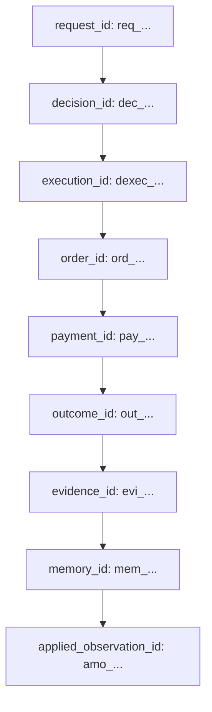

# Phase 9.4: Observability, Audit & Tenant Isolation Architecture

**Merchant Policy Agent — Autonomous Commercial Policy Learning for Selling to AI Buyers**  
**Track 01 — Razorpay AI Buildathon 2026**

---

## 1. Core Architectural Principle

> **"The observability layer must observe the system. It must NOT become the system."**

Phase 9.4 establishes production-grade operational observability, immutable auditability, and defense-in-depth tenant isolation across the Merchant Policy Agent runtime without modifying or duplicating any business, policy, or learning decisions.

### Telemetry Boundary
- **Observability MAY**: Record, measure, correlate, and audit.
- **Observability MUST NOT**:
  - Select commercial policies
  - Authorize transaction execution
  - Change Phase 5 transaction/provider truth
  - Alter Phase 8.2 reward definition ($Contribution = RealizedRevenue - COGS$)
  - Modify Phase 8.1 evidence eligibility
  - Mutate Phase 8.4 LinUCB model parameters or feature weights
  - Promote or rollback policies (Phase 8.8)
  - Change safety validation decisions (Phase 8.6)
  - Mutate catalog inventory (Phase 2)
  - Alter Razorpay payment state (Phase 1/5)
  - Override merchant tenant boundaries

---

## 2. Distinction of Core Operational Concepts

To avoid conceptual conflation, Phase 9.4 strictly defines and isolates four separate operational categories:

| Category | Medium | Authority & Retention | Purpose |
| :--- | :--- | :--- | :--- |
| **LOGS** | Structured application streams (`structlog`) | Operational, transient | Real-time debugging, lifecycle signals, error diagnostics |
| **AUDIT** | Relational database table (`audit_events`) | Append-only, strictly immutable | Legal, security, and governance historical trace |
| **METRICS** | In-memory atomic counters & latencies | Aggregated, non-authoritative | Health probes, traffic rates, failure frequency |
| **DOMAIN STATE** | Authoritative relational tables (`merchants`, `orders`, `policy_learning_model_states`, etc.) | Transactional state machines | Authoritative business, commercial, and learning state |

---

## 3. Correlation Identifier Model

Phase 9.4 strictly maintains identifier integrity without collapsing or replacing existing domain identities:

- **`request_id`** (`req_...`): Client transport correlation identifier. Injected or validated at `CorrelationMiddleware` and propagated through `contextvars.ContextVar` across async task boundaries.
- **`opportunity_id`** (`opp_...`): Commercial buyer opportunity context.
- **`decision_id`** (`dec_...`): Canonical policy decision record.
- **`authorization_id`** (`eauth_...`): Cryptographic execution authorization token.
- **`execution_id`** (`dexec_...`): Single-use boundary execution execution record.
- **`order_id`** / **`razorpay_order_id`**: Phase 5 transaction records.
- **`outcome_id`** (`out_...`): Resolved transaction outcome feedback record.
- **`evidence_id`** (`evi_...`): Admissible learning evidence record.
- **`memory_id`** (`mem_...`): Historical episodic policy memory record.
- **`applied_observation_id`** (`amo_...`): Model update application idempotency ledger.

---

## 4. Structured Logging Policy & Information Hygiene

Centralized structured logging is configured via [`apps/api/core/logging.py`](file:///c:/Users/DHANUSH%20A%20G/Desktop/razopay_new/apps/api/core/logging.py) using `structlog`.

### Automated Sanitization (`sensitive_data_filter_processor`)
Every emitted log event is recursively filtered through the hygiene processor:
1. **Secret Redaction**: Any dictionary key matching `*secret*`, `*key*`, `*signature*`, `*token*`, `*auth*`, or `*password*` is automatically redacted to `"[REDACTED]"`.
2. **Internal Economics Redaction**: Commercial secrets including `cogs_paise`, `gross_margin_percent`, `margin_percent`, `matrix_a`, `vector_b`, and `model_weights` are automatically redacted.
3. **Log Injection Neutralization**: Carriage returns (`\r`) and newlines (`\n`) are stripped from all string fields to prevent attackers from forging fake log lines or JSON delimiters.
4. **Cardinality & Payload Bounding**: Any string field exceeding 1024 characters is automatically truncated to prevent log flooding attacks.

---

## 5. Domain Audit Event Model & Immutability

Domain audit events are persisted in table `audit_events` conforming to contract `audit-event/v1`.

### Schema Attributes
- `audit_event_id`: Unique audit identifier (`aud_...`).
- `merchant_id`: Tenant scope (mandatory for tenant actions).
- `entity_type`: Target domain entity (`DECISION`, `EXECUTION`, `ORDER`, `OUTCOME`, `EVIDENCE`, `MODEL`).
- `entity_id`: Target entity primary key.
- `action`: Domain action identifier.
- `actor`: Initiating component/actor.
- `request_id`, `opportunity_id`, `decision_id`, `execution_id`, `outcome_id`, `evidence_id`: Canonical trace correlation keys.
- `payload`: Sanitized JSON snapshot.
- `created_at`: Server UTC timestamp (`func.now()`).

### Immutability Enforcement
Audit records are append-only. Application code cannot update, delete, or rewrite historical audit records.
- Enforced via SQLAlchemy ORM event listeners (`before_update` and `before_delete`) on model `AuditEvent`.
- Any attempt to update or delete raises `AuditImmutabilityViolationError`.

---

## 6. Tenant Isolation Defense-in-Depth

> **"MERCHANT_ID IS NEVER OPTIONAL FOR TENANT-SCOPED DOMAIN OPERATIONS."**

1. **Service Boundary Enforcement**:
   - Every lookup, query, and command (`CanonicalDecisionRuntime.decide`, `DecisionExecutionBoundaryService.execute_decision`, `OutcomeFeedbackService.process_outcome`, `AuditService.query_events`, `TraceReconstructionService.reconstruct_opportunity`) enforces `merchant_id`.
   - Cross-tenant lookups raise domain tenant violation errors (`DecisionTenantViolationError`, `OutcomeTenantViolationError`, `AuditTenantViolationError`) and fail closed with HTTP 403 or 404.
2. **Database Scoping**:
   - All tenant-owned tables (`products`, `merchants`, `canonical_decisions`, `decision_executions`, `outcome_feedbacks`, `learning_evidence`, `policy_memory`, `policy_learning_model_states`, `applied_model_observations`, `audit_events`) have indexed `merchant_id` foreign keys.
3. **Async / ContextVar Isolation**:
   - Correlation context uses `contextvars.ContextVar` managed with `token` reset on every request lifecycle, guaranteeing zero cross-tenant contamination across concurrent async coroutines.

---

## 7. Bounded Operational Metrics

Operational metrics are managed in [`services/observability/metrics.py`](file:///c:/Users/DHANUSH%20A%20G/Desktop/razopay_new/services/observability/metrics.py) via `RuntimeMetricsRegistry`.

### Strict Label Boundedness
To prevent metric store memory leaks and label cardinality explosions:
- Dynamic identifiers (`request_id`, `decision_id`, `execution_id`, `user_id`, raw error messages) are **strictly forbidden** as metric labels.
- Only bounded enumeration values (`component`, `status`, `operation`) are permitted.
- Labels are sanitized, lowercased, and truncated to 32 characters.

### Metric Categories
- **Requests**: `request_count`, `request_error_count`, `request_latency_ms` (avg, p95).
- **Decisions**: `decision_count[mode=explore|exploit, status=success|error]`.
- **Executions**: `execution_count[status=authorized|rejected]`.
- **Outcomes**: `outcome_count[status=payment_success|payment_failed, operation=completed]`.
- **Learning Pipeline**: `learning_pipeline_event[status=accepted|rejected|skipped, operation=evidence|memory|model]`.
- **Security Rejections**: `security_rejection_count[operation=cross_tenant_attempt|forged_fields]`.

---

## 8. Health, Readiness & Observability Endpoints

Managed via [`apps/api/routers/health.py`](file:///c:/Users/DHANUSH%20A%20G/Desktop/razopay_new/apps/api/routers/health.py) and [`apps/api/routers/observability.py`](file:///c:/Users/DHANUSH%20A%20G/Desktop/razopay_new/apps/api/routers/observability.py):

| Endpoint | Method | Purpose | Guarantees |
| :--- | :--- | :--- | :--- |
| `/health` | GET | Liveness probe | Zero state mutation, zero secret leakage, returns service metadata. |
| `/ready` | GET | Readiness probe | Local database ping (`SELECT 1`). Zero LLM or external Razorpay calls. |
| `/metrics` | GET | Metrics snapshot | Bounded operational metrics snapshot. |
| `/api/v1/observability/audit/events` | GET | Audit log query | Mandatory `merchant_id` tenant scoping. Append-only events. |
| `/api/v1/observability/trace` | GET | Trace reconstruction | Full 8-stage lifecycle reconstruction or diagnosis of stopped stage. |

---

## 9. Failure Semantics & Operational Degradation

| Failure Condition | System Behavior | Rationale |
| :--- | :--- | :--- |
| **Audit DB Write Failure** | Fails closed / rolls back transaction | Compliance-critical events must be transactionally durable with domain actions. |
| **Logging Output Interruption** | Continues domain operation | Logging failure must not silently authorize or deny business execution. |
| **Metrics Registry Update** | Continues domain operation | In-memory atomic counters are non-authoritative and non-blocking. |
| **Cross-Tenant Access Attempt** | Emits security rejection metric & raises 403/404 | Zero information leakage on existence of other tenants' entities. |
| **Log Injection Attempt** | Strips newlines (`\r`, `\n`) | Sanitizes input into single-line structured event. |
| **Oversized Field Payload** | Truncates to 1024 characters | Prevents log/audit payload flooding attacks. |

---

## 10. Known Remaining Risks & Boundaries

1. **Test Mode Operation**: All financial transactions and webhooks operate against Razorpay Test Mode (`rzp_test_...`); metrics and evidence do not represent real-money consumer conversions.
2. **Clock Source**: Timestamp ordering relies on the database server UTC clock (`func.now()`). Client-provided timestamps are never treated as authoritative.
3. **Retention Scope**: Audit records are persisted in relational storage (`audit_events`); this phase does not deploy external log aggregation clusters (Kafka/Elasticsearch) or claim infinite multi-year archive guarantees.
