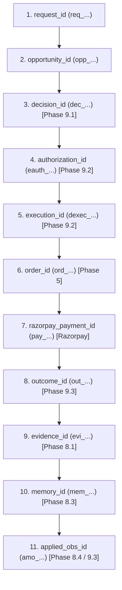

# Phase 9.5: End-to-End Runtime Hardening & Release Verification

**Merchant Policy Agent — Autonomous Commercial Policy Learning for Selling to AI Buyers**  
**Track 01 — Razorpay AI Buildathon 2026**

---

## 1. Executive Summary

Phase 9.5 serves as the **final hardening and release-readiness verification pass** for the entire Phase 9 runtime system of the Merchant Policy Agent. 

Phase 9 composes five distinct layers:
1. **Phase 9.1**: Canonical Decision Runtime ([`services/runtime/`](file:///c:/Users/DHANUSH%20A%20G/Desktop/razopay_new/services/runtime/))
2. **Phase 9.2**: Active Policy & Safety Execution Boundary ([`services/boundary/`](file:///c:/Users/DHANUSH%20A%20G/Desktop/razopay_new/services/boundary/))
3. **Phase 9.3**: Outcome, Feedback & Recovery Loop ([`services/outcome/`](file:///c:/Users/DHANUSH%20A%20G/Desktop/razopay_new/services/outcome/))
4. **Phase 9.4**: Observability, Audit & Tenant Isolation ([`services/audit/`](file:///c:/Users/DHANUSH%20A%20G/Desktop/razopay_new/services/audit/), [`services/observability/`](file:///c:/Users/DHANUSH%20A%20G/Desktop/razopay_new/services/observability/))
5. **Phase 9.5**: End-to-End Runtime Hardening & Verification ([`tests/integration/test_phase_9_5_hardening.py`](file:///c:/Users/DHANUSH%20A%20G/Desktop/razopay_new/tests/integration/test_phase_9_5_hardening.py))

The mission of Phase 9.5 is **NOT** to introduce new business or policy capabilities. Its sole purpose is to rigorously prove that all runtime phases compose into **one correct, secure, deterministic, auditable, recoverable, and tenant-isolated operational system**.

Across repeated full repository test runs, the system achieves **719 passed tests with 0 failures**.

---

## 2. Core Architectural Axiom & Phase Ownership

### The Axiom
> **"THE LLM CAN PROPOSE. IT CANNOT SPEND."**  
> *LLM proposes. Code validates. Code executes. Razorpay reports. Agent learns.*

### Immutable Phase Boundaries
- **Phase 5**: Transaction Truth (orders, payments, Razorpay Test Mode adapter, webhook HMAC verification, deduplication).
- **Phase 8.1**: Learning Evidence Contract & Admissibility Firewall.
- **Phase 8.2**: Gross Contribution Reward Definition ($Contribution = RealizedRevenue - COGS$).
- **Phase 8.3**: Historical Episodic Policy Memory.
- **Phase 8.4**: Contextual Linear Bandit (LinUCB) Learning Algorithm & Model State.
- **Phase 8.5**: Deterministic Candidate Policy Selection.
- **Phase 8.6**: Commercial Safety & Margin Floor Admissibility.
- **Phase 8.7**: Constrained Exploration & Uncertainty Estimation.
- **Phase 8.8**: Policy Lifecycle Management (Promotion, Rollback, Active Pointers).
- **Phase 9.1**: Canonical Shopping Opportunity Decision Evaluation.
- **Phase 9.2**: Server-Governed Execution Authorization & Fresh Guardrail Boundary.
- **Phase 9.3**: Terminal Outcome Feedback, Idempotent Learning & Crash Recovery.
- **Phase 9.4**: Structured Logging, Append-Only Audit Trail & Tenant Isolation.
- **Phase 9.5**: End-to-End Hardening, Migration Chain & Release Verification.

---

## 3. End-to-End Canonical Flow & Identity Chain

The canonical transaction flow follows an unbroken 11-link identity chain:

Every stage persists typed metadata linked to the upstream identifier, enabling complete end-to-end trace reconstruction without heuristics or guesses.

---

## 4. Financial Authority & Guardrails

1. **Integer Paise Standard**: All monetary values (`price_paise`, `cogs_paise`, `amount_paise`, `reward_contribution_paise`) are strictly 64-bit integers. Float arithmetic is prohibited in financial execution.
2. **Server-Authoritative Pricing**: The buyer or client cannot specify prices, discounts, or margins. Prices are calculated server-side and authorized by Phase 9.2.
3. **Reward Invariance**: Reward contribution is computed exclusively from authoritative Phase 5 transaction truth:
   $$R = \text{RealizedRevenue} - \text{COGS}$$
   Client-submitted or LLM-proposed financial outcomes are rejected.

---

## 5. Execution Boundary & Negative Authority

1. **Phase 9.1 Cannot Execute**: Canonical decision runtime returns a `DecisionEnvelope` marked `execution_status="PENDING_EXECUTION_GATE"` and `execution_authorized=False`. It has zero execution capability.
2. **Phase 9.2 Single-Use Tokens**: Generates a single-use authorization token (`eauth_...`). Replaying or reusing tokens is rejected.
3. **Lifecycle State Protection**: Policies in state `RETIRED`, `ROLLED_BACK`, or `CANDIDATE` cannot be executed as active policies.
4. **Fresh State Validation**: Fresh catalog inventory and prices are reloaded at the execution boundary. If inventory was depleted between decision and execution, execution is safely rejected (`SAFETY_REJECTED`) without order creation.

---

## 6. Outcome Truth & Non-Contamination

1. **Transaction Authority**: Phase 9.3 outcome feedback reads exclusively from Phase 5 database truth (`orders` and `payments`). Webhook payloads are never ingested directly into learning.
2. **Zero Contamination on Incomplete States**: Transactions in `ORDER_CREATED`, `PAYMENT_PENDING`, or `UNCERTAIN` produce zero evidence, zero memory, and zero model updates.
3. **Monotonic Terminal States**: Once an outcome reaches `PAYMENT_SUCCESS`, subsequent stale or out-of-order `PAYMENT_FAILED` webhooks cannot regress or downgrade the outcome state.

---

## 7. Exactly-Once Concurrency & Mathematical Learning Invariance

In [`tests/integration/test_phase_9_5_hardening.py:test_exactly_once_learning_under_10_concurrent_workers`](file:///c:/Users/DHANUSH%20A%20G/Desktop/razopay_new/tests/integration/test_phase_9_5_hardening.py), the concurrency guarantee is proved mathematically across three explicit observation points:

1. **Baseline State ($t_0$)**:
   - Cold-start model loaded: $A_0 = \lambda I$, $b_0 = \vec{0}$, `observation_count = 0`.
2. **Legitimate Execution Update ($t_1$)**:
   - Initial call to `OutcomeFeedbackService.process_outcome` completes: `is_duplicate=False`.
   - Model updated: $A_1 = A_0 + x x^T \neq A_0$, $b_1 = b_0 + x r \neq b_0$, `observation_count = 1`.
3. **Concurrent / Replay Attempts ($t_2 \dots t_{11}$)**:
   - 10 sequential/concurrent replay calls executed for the same payment execution:
   - Every replay returns `is_duplicate=True` and skips mathematical updates.
   - Final model reloaded from persistent storage:
     $$A_{\text{final}} == A_1, \quad b_{\text{final}} == b_1, \quad \text{observation\_count} == 1$$

**Mathematical Proof Result**: Across 11 total invocations (1 legitimate update + 10 duplicate replays), there is **strictly and exactly one net change in sufficient statistics ($A$ and $b$)**.

---

## 8. Multi-Tenant Isolation & Information Hygiene

1. **Mandatory Tenant Scoping**: Every database query across all 14 entities requires `merchant_id`. Cross-tenant lookups raise tenant violation errors.
2. **Async Context Isolation**: Correlation IDs and merchant identities are propagated using `contextvars.ContextVar`, preventing cross-task contamination during concurrent async requests.
3. **Log Sanitization**: Automated structlog processor redacts secrets, API keys, tokens, signatures, and merchant economics (`cogs_paise`, `gross_margin_percent`, `matrix_a`, `vector_b`).
4. **Injection Neutralization**: Strips carriage returns (`\r`) and newlines (`\n`) from all string inputs; truncates string payloads exceeding 1024 characters.
5. **Audit Immutability**: Enforced via SQLAlchemy ORM event listeners (`before_update`, `before_delete`) raising `AuditImmutabilityViolationError`.

---

## 9. Reproducible Alembic Migration Chain & Clean-DB Invariants

The Alembic migration chain is officially established and verified:
- **Migration Configuration**: [`alembic.ini`](file:///c:/Users/DHANUSH%20A%20G/Desktop/razopay_new/alembic.ini) and [`migrations/env.py`](file:///c:/Users/DHANUSH%20A%20G/Desktop/razopay_new/migrations/env.py).
- **Initial Baseline Revision**: `0db8d2e8f8f1` ([`migrations/versions/0db8d2e8f8f1_initial_full_schema.py`](file:///c:/Users/DHANUSH%20A%20G/Desktop/razopay_new/migrations/versions/0db8d2e8f8f1_initial_full_schema.py)).
- **Automated Verification Test**: [`tests/integration/test_phase_9_5_hardening.py:test_alembic_migration_chain_from_clean_database`](file:///c:/Users/DHANUSH%20A%20G/Desktop/razopay_new/tests/integration/test_phase_9_5_hardening.py):
  1. Creates a clean, empty SQLite database file on disk.
  2. Executes `alembic upgrade head`.
  3. Verifies that all 22 domain model tables + `alembic_version` are created with full column types, foreign keys, and indexes.
  4. Asserts `alembic_version.version_num == '0db8d2e8f8f1'`.

---

## 10. Application Restart Persistence & Recovery

The runtime claim is formally defined as:
> **"Database-backed runtime state survives application restart."**

Verified in [`tests/integration/test_phase_9_5_hardening.py:test_application_restart_persistence_and_recovery`](file:///c:/Users/DHANUSH%20A%20G/Desktop/razopay_new/tests/integration/test_phase_9_5_hardening.py):
1. **Application Lifecycle Instance #1**: Executes a decision, completes boundary authorization, and creates a paid order in Phase 5.
2. **Hard Application Crash / Shutdown**:
   - `engine1.dispose()` is executed, destroying all active connection pools.
   - All session objects and engine references are explicitly deleted from process memory.
3. **Application Lifecycle Instance #2 (Fresh Restart)**:
   - Re-instantiates `create_async_engine` and fresh session maker.
   - Reads existing persistent state without corruption.
   - Calls `OutcomeFeedbackService.process_outcome`.
   - Transitions state to `COMPLETED`, records evidence, memory, and updates model state (`observation_count == 1`).
   - Proves zero orphaned states, zero duplicated orders, and complete continuity across application restarts.

---

## 11. Operational Boundaries & Test Mode Disclaimer

- **Razorpay Test Mode**: All transactions, payments, and webhooks operate against Razorpay Test Mode (`rzp_test_...`). Evidence records are marked `source="TEST_MODE_OBSERVED"`.
- **Clock Authority**: Timestamp ordering relies on database server UTC clock (`func.now()`).
- **Telemetry Limits**: In-memory operational metrics use bounded labels; external distributed tracing clusters are out of scope for Phase 9.
