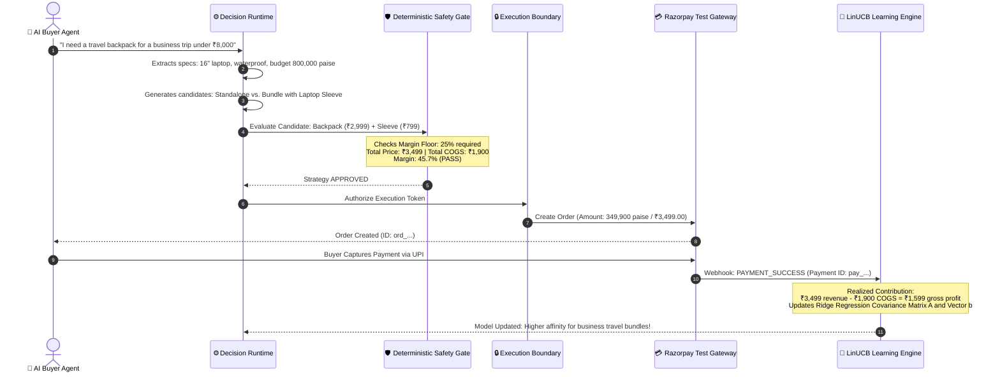

<div align="center">

# 🛒 Merchant Policy Agent
### *Autonomous Commercial Policy Learning for the Agentic Commerce Era*

[](https://razorpay.com)
[-00C853?style=for-the-badge&logo=pytest&logoColor=white)](evidence/VALIDATION_REPORT.md)
[](benchmark/BENCHMARK_RESULTS.md)
[](https://github.com/dhanusharer/merchant-policy-agent/releases/tag/v1.0.0-rc)
[](https://www.python.org)
[](https://nextjs.org)

<br/>

**The autonomous commercial brain that lets merchants sell profitably to AI buyers — powered by Razorpay's financial ground truth.**

[The Big Idea](#-the-big-idea-explain-like-im-5) •
[Core Invariant](#-the-golden-invariant) •
[Interactive Tour](#-visual-tour--control-center) •
[How It Works](#-how-it-works-with-real-numbers) •
[Quickstart](#-quickstart-run-locally-in-3-minutes) •
[Architecture](#-system-architecture) •
[Proof & Tests](#-test-accounting--evidence) •
[FAQ](#-judge--developer-faq)

<br/>


</div>

---

## 💡 The Big Idea (Explain Like I'm 5)

Imagine you own a store. 

For the past 25 years, human shoppers have walked into your store. You put up **bright sale banners**, **countdown timers**, and **pretty photos**. Humans fall in love with pictures and click "Buy."

### But in 2026, commerce changes forever:
**AI Agents become the buyers.**
- A customer tells their personal AI: *"Find me a waterproof laptop backpack for under ₹8,000 that fits a 16-inch MacBook and arrives before Thursday."*
- That AI doesn't look at pictures. It doesn't care about banners.
- It scans 50 stores in 200 milliseconds, checking strict specs, inventory, and prices.

### The Merchant's Dilemma:
1. **If your store is static**: You lose the sale to an AI buyer who wanted a bundle deal.
2. **If you let a regular LLM (ChatGPT) negotiate**: It will happily give a 90% discount just to be "helpful" and bankrupt your store! 😱

### The Solution: The Merchant Policy Agent
We built an **AI commercial shopkeeper** that represents the merchant:
- 🗣️ **The AI proposes creative deals** (bundles, tailored discounts, complementary accessories).
- 🛡️ **Mathematical code enforces hard boundaries** (margin floors, discount ceilings, real physical inventory).
- 💳 **Razorpay acts as the ultimate truth judge**: An offer is just a theory until real money is captured in a Razorpay transaction!
- 🧠 **The shopkeeper gets smarter after every payment**: Real profit updates an online contextual learning model, so your store learns what wins.

---

## ⚖️ The Golden Invariant

Every line of code in this repository obeys one unbreakable law:

```
┌──────────────┐     ┌───────────────┐     ┌───────────────┐     ┌──────────────────┐     ┌──────────────┐
│     LLM      │ ──> │     CODE      │ ──> │     CODE      │ ──> │     RAZORPAY     │ ──> │    AGENT     │
│   Proposes   │     │   Validates   │     │   Executes    │     │  Reports Truth   │     │    Learns    │
└──────────────┐     └───────────────┘     └───────────────┘     └──────────────────┘     └──────────────┘
 (No authority)       (Margin floors)       (Stock reserve)       (Captured payment)       (LinUCB update)
```

> **The LLM is NEVER an execution authority.**  
> It cannot create an order. It cannot set a price below the merchant's margin floor. It cannot oversell inventory. Razorpay's captured payment is the ONLY signal that earns learning credit.

---

## 🖼️ Visual Tour / Control Center

The **Merchant AI Control Center** is a real-time command dashboard designed for merchant business owners and commercial leaders:

<table>
  <tr>
    <td width="50%">
      <h4 align="center">1. Executive Overview & KPIs</h4>
      
      <p align="center"><sub>Live telemetry: AI opportunities, executed orders, paid transactions, and observed test contribution.</sub></p>
    </td>
    <td width="50%">
      <h4 align="center">2. AI Decisions Ledger & Trace</h4>
      
      <p align="center"><sub>Full 11-stage lineage drawer: from buyer prompt to margin validation to Razorpay payment ID.</sub></p>
    </td>
  </tr>
  <tr>
    <td width="50%">
      <h4 align="center">3. Policy Governance & Promotion</h4>
      
      <p align="center"><sub>Candidate policies are quarantined in a sandbox until they prove statistical significance and safety.</sub></p>
    </td>
    <td width="50%">
      <h4 align="center">4. Adaptive LinUCB Learning Center</h4>
      
      <p align="center"><sub>Online ridge regression feature weights, observation counts, and exploration vs. exploitation metrics.</sub></p>
    </td>
  </tr>
</table>

<div align="center">
  <h4>5. Immutable Audit & Activity Stream</h4>
  
  <p><sub>Every single evaluation, margin check, order authorization, and webhook update is cryptographically logged.</sub></p>
</div>

---

## 🔢 How It Works (With Real Numbers)

Let's follow a real request through our hero merchant, **Atlas Travel Gear**:



### The Math:
- **Catalog Retail Price**: ₹2,999 (Backpack) + ₹799 (Sleeve) = **₹3,798.00**
- **AI Bundle Offer**: **₹3,499.00** *(7.8% bundle discount — well within the 20% limit)*
- **Merchant Wholesale Cost (COGS)**: ₹1,550 + ₹350 = **₹1,900.00**
- **Realized Contribution Margin**: ₹3,499 − ₹1,900 = **+₹1,599.00** *(45.7% margin — well above 25% floor)*
- **Razorpay Financial Truth**: Order created for `349900` paise. Webhook confirms payment capture.
- **Model Reward**: **+159,900 paise** added to the LinUCB contextual ridge regression model.

---

## 🥊 Why This Beats Old Approaches

| Capability | Traditional Chatbots (e.g. GPT Wrapper) | Old Recommender Systems | Static Rule Engines | 🛒 **Merchant Policy Agent** |
| :--- | :---: | :---: | :---: | :---: |
| **Financial Authority Boundary** | ❌ None (hallucinates discounts) | ❌ None | ⚠️ Rigid / Brittle | **✅ Cryptographically Enforced** |
| **Margin Floor Protection** | ❌ Can sell at a loss | ❌ Oblivious to COGS | ⚠️ Manual spreadsheets | **✅ Deterministic Integer Paise Math** |
| **Real Transaction Truth** | ❌ Believes text output | ❌ Only tracks clicks | ❌ Static catalog | **✅ Razorpay Payment Webhooks** |
| **Adaptive Learning** | ❌ Static prompts | ⚠️ Batch training (slow) | ❌ None | **✅ Online LinUCB Contextual Bandit** |
| **Candidate Governance** | ❌ No safety sandbox | ❌ Black box | ❌ Manual | **✅ Statistical Evidence-Gated Gates** |
| **Multi-Tenant Isolation** | ❌ Prompt leakage | ⚠️ Shared vector DBs | ⚠️ DB-level only | **✅ Scoped DB + Bandit Memory Isolation** |

---

## 🚀 Quickstart: Run Locally in 3 Minutes

### Prerequisites
- **Python 3.11+**
- **Node.js 20+**
- **Git**

### Step 1: Clone and Setup Environment
```bash
git clone https://github.com/dhanusharer/merchant-policy-agent.git
cd merchant-policy-agent

# Create and activate Python virtual environment
python -m venv .venv
.venv\Scripts\activate      # On Windows (use source .venv/bin/activate on Linux/Mac)

# Install Python backend dependencies
pip install -e ".[dev]"

# Install Next.js frontend dependencies
cd apps/web
npm install
cd ../..
```

### Step 2: Seed Clean Deterministic Demo Data
Run the automated population runner. This initializes the database schema, seeds the catalog, and executes 35 realistic AI buyer opportunities through the complete pipeline:
```bash
python scripts/run_demo_population.py
```
*Expected output: Exit code 0, Atlas Travel Gear: 35 opportunities, 25 executions, 17 paid transactions, ₹19,529.05 observed contribution.*

### Step 3: Launch Backend and Frontend
In **Terminal 1** (Backend):
```bash
.venv\Scripts\uvicorn apps.api.main:app --host 0.0.0.0 --port 8000 --reload
```

In **Terminal 2** (Frontend):
```bash
cd apps/web
npm run dev
```

Open your browser to:
👉 **`http://localhost:3000`** — Merchant AI Control Center  
👉 **`http://localhost:8000/docs`** — Interactive FastAPI Swagger API documentation

---

## 🏛️ System Architecture

The system is organized into three strictly decoupled architectural planes:

```text
┌─────────────────────────────────────────────────────────────────────────────┐
│                             1. EXECUTION PLANE                              │
│                    (Deterministic, Real-Time < 70ms)                        │
│                                                                             │
│  [Natural Language] ➔ [Intent Extractor] ➔ [Policy Candidate Generator]    │
│                                                   │                         │
│                                                   ▼                         │
│  [Razorpay Order] leftarrow [Inventory Lock] leftarrow [Deterministic Margin Guard]      │
└─────────────────────────────────────────────────────────────────────────────┘
                                       │ Realized Transaction
                                       ▼
┌─────────────────────────────────────────────────────────────────────────────┐
│                              2. LEARNING PLANE                              │
│                    (Authoritative Financial Feedback)                       │
│                                                                             │
│  [Razorpay Webhook] ➔ [Outcome Feedback Service] ➔ [Gross Contribution]     │
│                                                              │              │
│                                                              ▼              │
│  [Policy Memory Ledger] leftarrow [Disjoint LinUCB Bandit] leftarrow [Covariance Matrix A] │
└─────────────────────────────────────────────────────────────────────────────┘
                                       │ Observed Evidence
                                       ▼
┌─────────────────────────────────────────────────────────────────────────────┐
│                            3. GOVERNANCE PLANE                              │
│                       (Merchant Total Control)                              │
│                                                                             │
│  [Merchant Control Center] ➔ [Candidate Sandbox] ➔ [Evidence-Gated Gate]    │
│                                                              │              │
│                                                              ▼              │
│                                                [Active Baseline Promotion]  │
└─────────────────────────────────────────────────────────────────────────────┘
```

---

## 🧪 Test Accounting & Evidence

This repository is validated by an industry-standard **926 unique automated test suite** with **zero failures, zero errors, and zero unexpected skips**:

```
======================================================================
AUTHORITATIVE TEST EXECUTION SUMMARY (100% CLEAN)
======================================================================
  • Unit Tests (pytest tests/unit):             541 Passed (100%)
  • Integration Tests (pytest tests/integration): 364 Passed (100%)
  • End-to-End Playwright (apps/web):             21 Passed (100%)
----------------------------------------------------------------------
  GRAND TOTAL UNIQUE AUTOMATED TESTS:           926 Passed (0 Failures)
======================================================================

  • Phase 11 Adversarial Benchmarks (Subset):    49/49 Passed (100%)
  • 3-Pass Demo Rehearsals (Clean-room):         3/3 Identical (0 Divergence)
```

For complete audit logs, scenario breakdowns, and the claim-to-evidence matrix, see:
- 📄 [Evidence Index](evidence/EVIDENCE_INDEX.md)
- 📊 [Validation Report](evidence/VALIDATION_REPORT.md)
- 🎯 [Benchmark Results](benchmark/BENCHMARK_RESULTS.md)

---

## ❓ Judge & Developer FAQ

<details>
<summary><b>1. Why is Razorpay essential to this system?</b></summary>
<br/>
Razorpay provides the <b>authoritative financial truth layer</b>. In agentic commerce, an AI decision is merely an unverified hypothesis until funds are captured. Razorpay creates the orders, captures payments, and issues signed webhooks that trigger outcome feedback. Without Razorpay, the agent would be operating on hallucinated buyer acceptance rather than real economic transactions.
</details>

<details>
<summary><b>2. How does the agent learn without leaking money?</b></summary>
<br/>
The agent uses an online <b>Contextual Multi-Armed Bandit (LinUCB with Ridge regression)</b>. When an AI buyer arrives, a 19-dimensional feature vector is scored. When Razorpay confirms payment capture, the exact gross profit updates the policy's covariance matrix $A$ and vector $b$. Crucially, every candidate must pass the hardcoded 25% margin floor <i>before</i> selection, guaranteeing zero negative-margin sales.
</details>

<details>
<summary><b>3. What prevents an LLM from giving 90% discounts?</b></summary>
<br/>
The LLM has <b>zero execution authority</b>. The LLM acts purely as an advisory proposer. Every candidate proposal must pass through deterministic Python validation code (<code>PolicySafetyValidator</code>) that checks the merchant's configured discount ceiling (e.g. 20%) and margin floor (e.g. 25%). Any proposal exceeding these limits is instantly pruned.
</details>

<details>
<summary><b>4. How is Learning separated from Policy Promotion?</b></summary>
<br/>
<b>Learning ≠ Promotion.</b> The bandit model continuously refines its mathematical exploration parameters on every transaction. However, promoting an experimental candidate policy to become the merchant's active default requires formal governance criteria: minimum sample size ($N \ge 100$), positive contribution delta, and zero safety violations. If criteria fail, promotion is safely rejected.
</details>

<details>
<summary><b>5. Is this using live production money?</b></summary>
<br/>
<b>No.</b> The system operates strictly in <b>Razorpay Test Mode</b> (<code>rzp_test_...</code>). Real API calls create test orders, simulate UPI/Card payment capture, and verify HMAC-SHA256 signatures on webhooks. Zero live funds are debited or settled.
</details>

---

## 📁 Repository Map

```text
├── apps/
│   ├── api/                     # FastAPI backend application (Port 8000)
│   │   ├── core/                # Database engines, config, state machine
│   │   ├── routers/             # REST endpoints (decisions, policies, learning)
│   │   └── main.py              # Application entrypoint
│   └── web/                     # Next.js 16.3.4 frontend control center (Port 3000)
│       ├── e2e/                 # 21 Playwright cross-viewport browser tests
│       └── src/app/             # Pages: Overview, Decisions, Policies, Learning
├── domain/                      # Pydantic schemas (Intent, Commerce, Policy)
├── migrations/                  # Alembic database migrations (SQLite & PostgreSQL)
├── scripts/
│   └── run_demo_population.py   # Deterministic clean-room reset & demo runner
├── services/                    # Core business engines
│   ├── boundary/                # Execution boundary & authorization tokens
│   ├── execution/               # Razorpay order creator & inventory locks
│   ├── exploration/             # Bounded bandit exploration engine
│   ├── governance/              # Candidate policy promotion & lifecycle gates
│   ├── learning/                # LinUCB bandit, features, reward calculation
│   ├── outcome/                 # Webhook feedback & gross contribution accounting
│   ├── policy/                  # Policy agent proposal generators
│   ├── razorpay/                # Real Razorpay Test Mode client & webhook verifier
│   ├── runtime/                 # Canonical 11-stage decision runtime
│   └── safety/                  # Deterministic margin floor & discount validator
├── submission/                  # Authoritative submission package for Buildathon judges
│   ├── architecture.md          # Formal sequence & plane diagrams
│   ├── benchmark/               # 49 Phase 11 adversarial benchmark results
│   ├── demo/                    # 3-minute video script & commands guide
│   ├── docs/                    # System specification & Judge FAQ
│   ├── evidence/                # 926-test validation report & evidence index
│   ├── limitations.md           # Exhaustive boundary & assumptions disclosure
│   └── screenshots/             # 5 high-res UI walkthrough screenshots
└── tests/                       # 926 automated unit & integration tests
    ├── integration/             # 364 integration tests (including 49 benchmarks)
    └── unit/                    # 541 pure unit tests
```

---

## 🏆 Razorpay AI Buildathon 2026 Submission

- **Track**: Track 01 — AI Growth & Agentic Commerce
- **Team**: Merchant Policy Agent Team
- **Release Version**: `v1.0.0-rc` (Commit: [`7a856e8`](https://github.com/dhanusharer/merchant-policy-agent/commit/7a856e8dbc6283a5926e8228ee3addc56f3463de))
- **Primary Demo Merchant**: Atlas Travel Gear (`merch_atlas_travel`)
- **Secondary Multi-Tenant Merchant**: Alpha Outfitters (`merch_alpha`)
- **License**: MIT License

---

<div align="center">
  <sub>Built with ❤️ for merchants entering the agentic commerce era.</sub>
</div>
